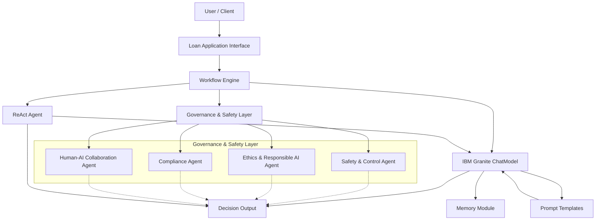

# AI Governance Framework

This project addresses the critical challenges posed by modern AI systems: the risks of bias, errors, security threats, ethical dilemmas, and ineffective human-AI collaboration. To mitigate these risks, we introduce the AI Governance Framework, a layered solution deploying specialized Governance & Safety Agents. This framework offers comprehensive, proactive oversight, ensuring AI systems are not only technically robust but also ethically aligned and regulatory compliant. Our unique approach integrates technical safety with ethical, regulatory, and collaborative measures, systematically managing potential risks to build trustworthy AI applications, as demonstrated in our AI-Driven Loan Approval System use case.

## Use Case: Trustworthy AI Loan Approval System

A full-stack solution demonstrating a Trustworthy AI approach built with the BeeAI Framework and IBM Granite models. This project implements a comprehensive Safety and Governance layer to automate and secure the loan approval process while ensuring ethical and regulatory compliance.

## Overview

Modern AI systems can transform business operations, but they also introduce risks such as bias, errors, and security vulnerabilities. Our solution tackles these challenges by integrating multiple layers of governance into an AI-driven loan approval system. We leverage IBM Granite models (via the Ollama provider) along with BeeAI’s modular components—including governance agents, prompt templates, memory, workflows, and ReAct agents—to build a system that is:
  
- **Safe & Controlled:** Monitors for bias and anomalies.
- **Ethically Aligned:** Ensures decisions adhere to ethical guidelines.
- **Regulatory Compliant:** Audits decisions against financial and legal standards.
- **Collaborative:** Enables human oversight to override AI decisions when necessary.

This project was developed for a hackathon challenge with the following key objectives:
- **Harness IBM Granite Models:** Utilize IBM Granite’s advanced language modeling for business applications.
- **Focus on Efficiency:** Automate workflows to optimize operations and improve productivity.
- **Innovate for Impact:** Deliver a groundbreaking solution that revolutionizes business processes in the financial sector.

## Features

- **Governance Agents:**  
  - *SafetyControlAgent*: Monitors loan application data for bias.  
  - *EthicsAgent*: Reviews decision criteria to ensure ethical fairness.  
  - *ComplianceAgent*: Audits decisions for regulatory compliance.  
  - *HumanCollaborationAgent*: Facilitates human review and override when necessary.
  
- **Prompt Templates:** Dynamically generate prompts using BeeAI’s templating system.
- **IBM Granite Integration:** Interact with IBM Granite models for high-quality responses.
- **Memory & Workflows:** Retain conversation history and automate multi-step processes.
- **ReAct Agents:** Enable intelligent reasoning and actions for dynamic decision making.
- **Modular Architecture:** Clean, scalable, and well-organized code structure.

## File Structure

```
ai-governance-framework/
├── README.md
├── LICENSE
├── requirements.txt
├── hackathon_presentation.md
├── .gitignore
├── docs/
│   ├── tutorial.md
│   └── architecture_diagram.png
└── src/
    ├── __init__.py
    ├── main.py
    ├── agents.py
    ├── governance.py
    ├── prompt_templates.py
    ├── chat_model_examples.py
    ├── workflows.py
    └── react_agents.py
```

- **README.md:** Project overview, setup, usage, and other key details.
- **LICENSE:** Project license (MIT License recommended).
- **requirements.txt:** Python dependencies.
- **hackathon_presentation.md:** Pitch and presentation details for the hackathon.
- **docs/tutorial.md:** Detailed tutorial and documentation.
- **docs/architecture_diagram.png:** Visual representation of the system architecture.
- **src/**: Contains all the source code modules.


## Architecture



This diagram shows how a user's loan application flows through the system, with the Workflow Engine coordinating interactions between the Governance & Safety Layer (which includes the key agents), the IBM Granite ChatModel (enhanced with prompt templates and memory), and the ReAct agent to produce a final decision output.


## Prerequisites

- **Python 3.8+**  
- **Dependencies:**  
  Install using:
  ```bash
  pip install -r requirements.txt
  ```
- **BeeAI Framework:** Ensure that BeeAI and its dependencies are installed.
- **IBM Granite (Ollama Provider):** Configure your environment for IBM Granite (see [IBM Granite documentation](https://www.ibm.com/granite/docs) for details).
- **SearXNG (Optional):** For web search integration, have a running SearXNG instance.

## Installation

1. **Clone the Repository:**
   ```bash
   git clone [https://github.com/ruslanmv/ai-governance-framework.git](https://github.com/ruslanmv/ai-governance-framework.git)
   cd ai-governance-framework
   ```
2. **Install Dependencies:**
   ```bash
   pip install -r requirements.txt
   ```

## Usage

- **Run the Main Application:**  
  The main entry point runs both a ChatModel demo and the end-to-end loan approval workflow.
  ```bash
  python src/main.py
  ```

- **Interactive Workflow:**  
  During execution, the system will prompt for human review input when necessary (simulate human oversight).

- **Test ReAct Agents:**  
  To run the ReAct agent demonstration separately:
  ```bash
  python src/react_agents.py
  ```

## Contributing

Contributions are welcome! Feel free to fork the repository and submit pull requests. For major changes, please open an issue first to discuss your ideas.

## License

This project is licensed under the MIT License. See the [LICENSE](LICENSE) file for details.

## Acknowledgements

We thank our contributors, the BeeAI community, and IBM Granite for providing the powerful tools that made this project possible. Special thanks to everyone who supported this hackathon initiative.
