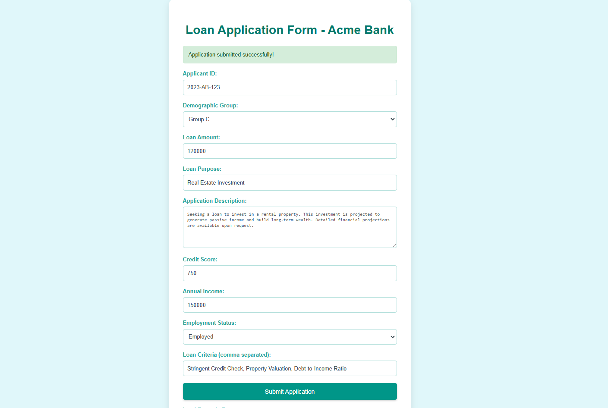
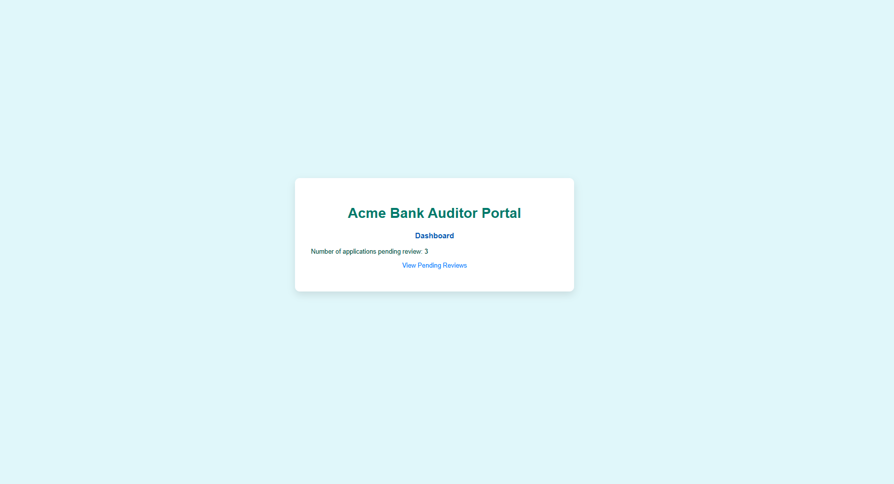
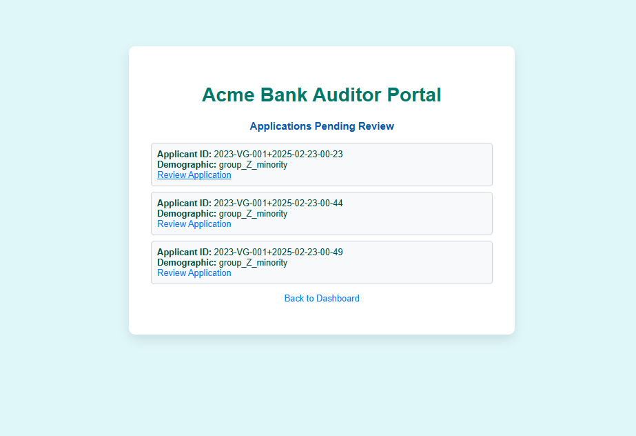

# AI Governance Framework

This project addresses the critical challenges posed by modern AI systems: bias, errors, security threats, ethical dilemmas, and ineffective human-AI collaboration. The AI Governance Framework is a layered solution that deploys specialized Governance & Safety Agents to provide comprehensive, proactive oversight. This approach ensures that AI systems are technically robust, ethically aligned, and regulatory compliant. Our AI-Driven Loan Approval System use case demonstrates how to automate and secure loan approvals while enforcing ethical and regulatory standards.

## Use Case: Self-Auditing Financial AI

Our solution is a full-stack demonstration of a Trustworthy AI approach built with the BeeAI Framework and IBM Granite models. It integrates a comprehensive Safety and Governance layer to automate and secure the loan approval process.

## Overview

Modern AI systems can revolutionize business operations but also introduce risks like bias, errors, and security vulnerabilities. Our solution integrates multiple layers of governance into an AI-driven loan approval system by leveraging:

*   **IBM Granite Models (via Ollama):** For advanced language modeling.
*   **BeeAI Modular Components:** Including governance agents, prompt templates, memory, workflows, and ReAct agents.

The system is designed to be:

*   **Safe & Controlled:** Monitors for bias and anomalies.
*   **Ethically Aligned:** Ensures decisions adhere to ethical guidelines.
*   **Regulatory Compliant:** Audits decisions against legal standards using structured outputs.
*   **Collaborative:** Allows human oversight to override AI decisions when necessary.

### Key Objectives

*   **Harness IBM Granite Models:** Utilize cutting-edge language modeling for business applications.
*   **Optimize Efficiency:** Automate workflows to enhance productivity.
*   **Drive Innovation:** Deliver a transformative solution for the financial sector.

## Features

*   **Governance Agents:**
    *   `SafetyControlAgent`: Monitors loan data for bias.
    *   `EthicsAgent`: Evaluates loan criteria against ethical guidelines.
    *   `ComplianceAgent`: Audits decisions for regulatory compliance using structured outputs.
    *   `HumanCollaborationAgent`: Facilitates human oversight—flagging cases for later review when needed.
*   **Prompt Templates:** Dynamically generate prompts using BeeAI’s templating system.
*   **IBM Granite Integration:** Interact with IBM Granite models for high-quality responses.
*   **Memory & Workflows:** Retain conversation history and automate multi-step processes.
*   **ReAct Agents:** Enable intelligent reasoning and adaptive decision-making.
*   **Modular Architecture:** A clean, scalable, and well-organized code structure.

## File Structure

```

ai-governance-framework/
├── README.md            
├── LICENSE            
├── requirements.txt    
├── hackathon\_presentation.md 
├── .gitignore
├── docs/
│   ├── tutorial.md     
│   └── architecture\_diagram.md 
       
└── src/
├── **init**.py   
├── auditor.py       
├── server.py        \# FastAPI server for processing loan application submissions.
├── agents.py        \# Contains all governance agent implementations.
├── chat.py           \# ChatModel interactions.
├── workflows.py     \# Workflow definitions for the loan approval process.
└── react\_agents.py  \# ReAct agent examples.
└── client.py        \# Flask web app for submitting loan applications.

````

## Architecture Diagram

```mermaid
flowchart TD
    A[User / Client] --> B[Loan Application Interface]
    B --> X[FastAPI Server]
    X --> C[Workflow Engine]
    
    subgraph Governance & Safety Layer
        D1[Safety & Control Agent]
        D2[Ethics & Responsible AI Agent]
        D3[Compliance Agent]
        D4[Human-AI Collaboration Agent\nFlags for review]
    end
    
    C --> D[Governance & Safety Layer]
    D --> D1
    D --> D2
    D --> D3
    D --> D4
    
    C --> E[IBM Granite ChatModel]
    E --> F[Prompt Templates]
    E --> G[Memory Module]
    
    C --> H[ReAct Agent]
    
    E --> I[Decision Output]
    
    D1 -.-> I
    D2 -.-> I
    D3 -.-> I
    D4 -.-> I
    H --> E
    F --> E
    H --> I
    
    I --> Y[Auditor Dashboard]
````

This diagram illustrates how a user's loan application flows through the system. The FastAPI Server receives submissions from the Client, and the Workflow Engine coordinates interactions between the Governance & Safety Layer (including Safety, Ethics, Compliance, and Human-AI Collaboration Agents), the IBM Granite ChatModel (using prompt templates and memory), and the ReAct Agent. The final decision output is then sent to an Auditor Dashboard for further review if necessary.

## Prerequisites

  * **Python 3.12+**
  * **Dependencies:** Install via: `pip install -r requirements.txt`
  * **BeeAI Framework:** Ensure BeeAI and its dependencies are installed.
  * **IBM Granite (Ollama Provider):** Set up your environment as per IBM Granite documentation.
  * **SearXNG (Optional):** For web search integration, ensure a SearXNG instance is running.

## Installation

1.  **Clone the Repository:**
    ```bash
    git clone [https://github.com/ruslanmv/ai-governance-framework.git](https://github.com/ruslanmv/ai-governance-framework.git)
    cd ai-governance-framework
    ```
2.  **Install Dependencies:**
    ```bash
    pip install -r requirements.txt
    ```

## Usage

### Server-Side Pipeline:

1.  Run the FastAPI server:
    ```bash
    @echo off
    call venv\Scripts\activate
    cd src
    uvicorn server:app --reload
    ```

### Client Portal:

1.  Launch the Flask client:
    ```bash
    python src/client.py
    ```
2.  Submit loan applications through the web interface.

### Auditor Dashboard:

1.  Run the auditor app:
    ```bash
    python auditor.py
    ```
2.  Visit `http://localhost:5001` to review and update flagged applications.

### Running Demos:

  * **Main Application Demo (ChatModel & Workflow):**
    ```bash
    python src/main.py
    ```
  * **ReAct Agents Demo:**
    ```bash
    python src/react_agents.py
    ```

## Screenshots

### Application Portal




### Auditor Dashboard






## Contributing

Contributions are welcome\! Please fork the repository and submit pull requests. For major changes, open an issue first to discuss your ideas.

## License

This project is licensed under the MIT License. See the [LICENSE](LICENSE) file for details.

## Acknowledgements

We gratefully acknowledge our contributors, the BeeAI community, and IBM Granite for the robust tools that made this project possible. Special thanks to everyone who supported this hackathon initiative.

Happy coding and building trustworthy AI systems\!

