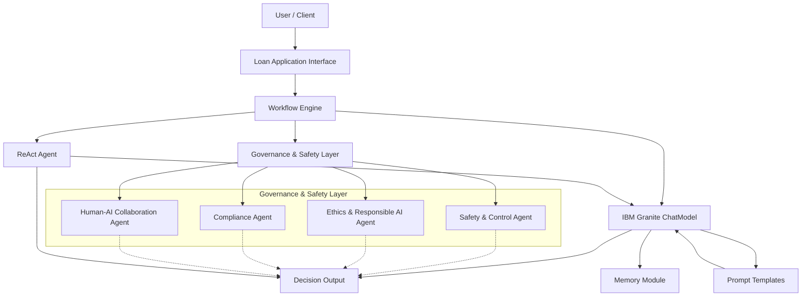

This diagram shows how a user's loan application flows through the system, with the Workflow Engine coordinating interactions between the Governance & Safety Layer (which includes the key agents), the IBM Granite ChatModel (enhanced with prompt templates and memory), and the ReAct agent to produce a final decision output.