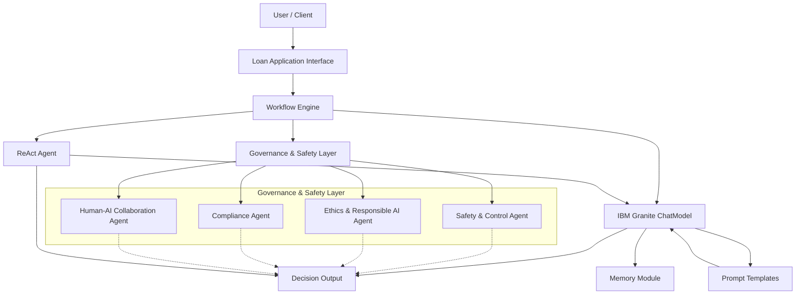

# Trustworthy AI Loan Approval System Tutorial

Welcome to the comprehensive tutorial for building a Trustworthy AI Loan Approval System using the BeeAI Framework and IBM Granite models. In this guide, you will learn how to integrate a robust Safety and Governance layer into an AI-driven solution that automates loan approvals while ensuring ethical, regulatory, and human oversight.

---

## Table of Contents

1. [Introduction](#introduction)
2. [Project Overview](#project-overview)
3. [Prerequisites](#prerequisites)
4. [Project Structure](#project-structure)
5. [Step 1: Setting Up the Environment](#step-1-setting-up-the-environment)
6. [Step 2: Building Governance Agents](#step-2-building-governance-agents)
   - [Safety & Control Agent](#safety--control-agent)
   - [Ethics & Responsible AI Agent](#ethics--responsible-ai-agent)
   - [Regulatory Compliance Agent](#regulatory-compliance-agent)
   - [Human-AI Collaboration Agent](#human-ai-collaboration-agent)
7. [Step 3: Creating Prompt Templates](#step-3-creating-prompt-templates)
8. [Step 4: Integrating IBM Granite ChatModel](#step-4-integrating-ibm-granite-chatmodel)
9. [Step 5: Implementing Workflows](#step-5-implementing-workflows)
10. [Step 6: Demonstrating ReAct Agents](#step-6-demonstrating-react-agents)
11. [Step 7: Running the End-to-End Application](#step-7-running-the-end-to-end-application)
12. [Client & Auditor Applications](#client--auditor-applications)
13. [Conclusion](#conclusion)

---

## Introduction

AI systems promise tremendous benefits, yet they also introduce risks such as bias, regulatory non-compliance, and ethical dilemmas. This tutorial shows you how to build an AI-driven loan approval system that integrates multiple layers of governance. Our solution leverages IBM Granite models (via Ollama) and the BeeAI Framework to automate approvals while ensuring fairness, transparency, and human oversight.

---

## Project Overview

Our solution consists of:

- **Governance Agents:**  
  - **Safety & Control Agent:** Monitors loan application data for potential bias.  
  - **Ethics & Responsible AI Agent:** Evaluates applications against Acme Bank’s ethical guidelines.  
  - **Regulatory Compliance Agent:** Audits decisions using structured output and financial regulations.  
  - **Human-AI Collaboration Agent:** Facilitates human oversight for flagged cases.
- **Prompt Templates:** Dynamically format and generate prompts for interacting with the LLM.
- **ChatModel Integration:** Uses IBM Granite (via Ollama) to generate responses.
- **Workflows:** Automates the end-to-end process, flagging applications for later override when the AI decision is “requires further review.”
- **Client & Auditor Applications:**  
  - A **client.py** provides a web interface for submitting loan applications.  
  - An **auditor.py** dashboard enables administrators to review and update decisions on flagged applications.

---

## Prerequisites

Ensure you have:

- Python 3.8 or higher.
- All required packages (see `requirements.txt`).
- The BeeAI Framework installed.
- IBM Granite configured (via Ollama).
- (Optional) A running SearXNG instance if you wish to integrate web search.

Install dependencies with:
```bash
pip install -r requirements.txt
```

---

## Project Structure

A suggested file structure is:

```
ai-governance-framework/
├── README.md
├── LICENSE
├── requirements.txt
├── docs/
│   └── tutorial.md       # (This file)
├── auditor.py
└── src/
    ├── __init__.py
    ├── main.py
    ├── server.py
    ├── agents.py
    ├── prompt_templates.py
    ├── chat_model_examples.py
    ├── workflows.py
    ├── react_agents.py
    └── client.py
```

Each file is dedicated to a specific component, making the project modular and scalable.

---

## Architecture



This diagram illustrates the flow of a loan application through the system—from submission through governance agents to a final decision.

---

## Step 1: Setting Up the Environment

Clone the repository and install dependencies:
```bash
git clone https://github.com/ruslanmv/ai-governance-framework.git
cd ai-governance-framework
pip install -r requirements.txt
```

---

## Step 2: Building Governance Agents

### Safety & Control Agent

Monitors incoming loan application data for bias by combining demographic and red flag information.

```python
# File: src/agents.py (SafetyControlAgent section)
import asyncio
import json
import os
from typing import List, Optional
from pydantic import BaseModel, Field
from beeai_framework.backend.message import SystemMessage, UserMessage
from beeai_framework.backend.chat import ChatModel, ChatModelInput, ChatModelOutput
from beeai_framework.backend.chat import ChatModelStructureInput

# Create a shared global ChatModel instance.
model = ChatModel.from_name("ollama:granite3.1-dense:8b")

class SafetyControlAgent:
    async def monitor_loan_data(self, loan_applications):
        print("SafetyControlAgent: Extracting demographic data...")
        demographic_data = self._extract_demographic_data(loan_applications)
        red_flag_data = self._extract_red_flag_data(loan_applications)
        print("DEBUG: Extracted risk flag data:", red_flag_data)
        
        demographic_data_string = ", ".join(demographic_data["demographics"])
        red_flag_string = ", ".join(red_flag_data["red_flag"])
        user_message_text = f"Demographics: {demographic_data_string}. Red flag info: {red_flag_string}."
        print("DEBUG: user_message SafetyControlAgent:", user_message_text)
        
        SafetyControlAgent_prompt = (
            "You are a Safety Agent. Your job is to check for potential bias in loan applications based on demographic groups.\n"
            "Task: Review the provided loan application data. For each demographic group mentioned, decide if there is potential bias against that group.\n"
            "Output: For each demographic group, respond with ONE of these:\n"
            ' "Bias likely for: [Demographic Group Name]" (if you suspect bias)\n'
            ' "No bias for: [Demographic Group Name]" (if you see no bias)\n'
        )
        system_message = SystemMessage(content=SafetyControlAgent_prompt)
        user_message = UserMessage(content=user_message_text)
        
        print("DEBUG: Sending SafetyControlAgent request to LLM...")
        output: ChatModelOutput = await model.create(ChatModelInput(messages=[system_message, user_message]))
        result = output.get_text_content().strip()
        print("DEBUG: SafetyControlAgent LLM response:", result)
        
        if "Bias likely" in result:
            self._trigger_alert(result)
        else:
            print("SafetyControlAgent: No bias detected in loan approvals.")
        return result

    def _extract_demographic_data(self, loan_applications):
        return {"demographics": [app.get("demographic", "unknown") for app in loan_applications]}
    
    def _extract_red_flag_data(self, loan_applications):
        return {"red_flag": [app.get("risk_flag", "unknown") for app in loan_applications]}

    def _trigger_alert(self, message):
        print(f"SafetyControlAgent ALERT: {message}")
```

### Ethics & Responsible AI Agent

Evaluates loan applications against Acme Bank’s ethical guidelines.

```python
# File: src/agents.py (EthicsAgent section)
current_directory = os.getcwd()
full_ethics_path = os.path.join(current_directory, "acme_bank_ethics_guidelines.txt")
with open(full_ethics_path, "r") as f:
    acme_ethics_context = f.read()

EthicsAgent_prompt = f"""You are an Ethics Agent for Acme Bank. Your role is to evaluate loan applications against **Acme Bank's ethical guidelines** to ensure they align with our company's ethical standards.

**Context: Acme Bank Ethical Guidelines**
```
{acme_ethics_context}
```

**Task:** Analyze the loan application data provided and determine if the loan application and its criteria are ETHICAL or UNETHICAL according to the above guidelines.

**Instructions:**
1. Carefully read the ethical guidelines.
2. Examine the application data (provided as JSON).
3. Evaluate each criterion.
4. State your conclusion as either "ETHICAL" or "UNETHICAL" (and list any violations).

**Begin!**
"""
system_message_ethics = SystemMessage(content=EthicsAgent_prompt)

class EthicsAgent:
    async def review_decision_criteria(self, loan_application_data_json):
        print("DEBUG: EthicsAgent: Starting ethical review using LLM...")
        user_message_ethics = UserMessage(content=loan_application_data_json)
        print("DEBUG: EthicsAgent: Loan application JSON sent to LLM:", loan_application_data_json)
        try:
            output_ethics: ChatModelOutput = await model.create(
                ChatModelInput(messages=[system_message_ethics, user_message_ethics])
            )
            ethics_assessment_text = output_ethics.get_text_content()
            print("DEBUG: EthicsAgent: Raw LLM response:", ethics_assessment_text)
            return self._process_ethics_assessment(ethics_assessment_text)
        except Exception as e:
            print(f"EthicsAgent Error during LLM processing: {e}")
            return {"ethical": False, "reasons": ["Error during ethical review processing."]}

    def _process_ethics_assessment(self, assessment_text):
        print("DEBUG: EthicsAgent: Processing ethical assessment...")
        print(f"DEBUG: EthicsAgent Raw Assessment: {assessment_text}")
        if "ETHICAL" in assessment_text.upper():
            print("EthicsAgent: Loan application deemed ETHICAL by LLM.")
            return {"ethical": True, "reasons": []}
        elif "UNETHICAL" in assessment_text.upper():
            unethical_reasons = []
            if "Violates Guideline" in assessment_text:
                reasons_start_index = assessment_text.find("Violates Guideline")
                unethical_reasons_text = assessment_text[reasons_start_index:]
                unethical_reasons = [reason.strip() for reason in unethical_reasons_text.split("Guideline") if reason.strip()]
            print(f"EthicsAgent ALERT: Loan application deemed UNETHICAL by LLM. Reasons: {unethical_reasons}")
            return {"ethical": False, "reasons": unethical_reasons}
        else:
            print("EthicsAgent: Inconclusive ethical assessment from LLM.")
            return {"ethical": None, "reasons": ["Inconclusive ethical assessment from LLM. Review manually."]}

    def _flag_criteria(self, unethical_assessment_result):
        if not unethical_assessment_result["ethical"]:
            reasons = unethical_assessment_result["reasons"]
            if reasons:
                print(f"EthicsAgent ALERT: Loan application deemed UNETHICAL. Violations: {', '.join(reasons)}")
            else:
                print("EthicsAgent ALERT: Loan application deemed UNETHICAL. Reasons not specified by LLM.")
        else:
            print("EthicsAgent: Loan application deemed ETHICAL.")
```

### Regulatory Compliance Agent

Audits the loan decision against financial regulations using structured LLM output.

```python
# File: src/agents.py (ComplianceAgent section)
class ComplianceReportSchema(BaseModel):
    is_compliant: bool = Field(description="Indicates if the loan decision complies with regulations.")
    non_compliant_regulations: Optional[List[str]] = Field(default=None, description="List of violated regulation names.")
    reasons: Optional[List[str]] = Field(default=None, description="Detailed reasons for non-compliance.")

current_directory = os.getcwd()
regulations_file_path = os.path.join(current_directory, "financial_regulations.txt")
full_regulations_path = os.path.join(os.getcwd(), regulations_file_path)
try:
    with open(full_regulations_path, 'r') as f:
        financial_regulations_context = f.read()
    print("DEBUG: ComplianceAgent: Financial regulations loaded from text file.")
except FileNotFoundError:
    financial_regulations_context = "Financial regulations context not found. Please ensure financial_regulations.txt exists."
    print(f"Warning: {regulations_file_path} not found. ComplianceAgent will run without regulation context.")

ComplianceAgent_prompt = f"""You are a Compliance Agent for Acme Bank, specialized in auditing loan decisions for regulatory compliance.
**Context: Financial Regulations**
```
{financial_regulations_context}
```
**Task:** Analyze the provided loan decision data and determine if it complies with the above financial regulations.
**Output Format:** Respond with a JSON object conforming to ComplianceReportSchema.
Begin!
"""
system_message_compliance = SystemMessage(content=ComplianceAgent_prompt)

class ComplianceAgent:
    async def audit_for_compliance(self, loan_decision_json):
        print("DEBUG: ComplianceAgent: Starting compliance audit using RAG and LLM...")
        print("DEBUG: ComplianceAgent: Loan decision JSON sent to LLM:", loan_decision_json)
        user_message_compliance = UserMessage(content=loan_decision_json)
        try:
            output_compliance: ChatModelOutput = await model.create_structure(
                ChatModelStructureInput(
                    schema=ComplianceReportSchema,
                    messages=[system_message_compliance, user_message_compliance]
                )
            )
            print("DEBUG: ComplianceAgent: Raw output from model.create_structure:", output_compliance)
            compliance_report_data = output_compliance.object
            print("DEBUG: ComplianceAgent: Raw compliance report data:", compliance_report_data)
            compliance_report = ComplianceReportSchema.parse_obj(compliance_report_data)
            print("DEBUG: ComplianceAgent: Parsed compliance report:", compliance_report)
            return self._process_compliance_report(compliance_report)
        except Exception as e:
            print(f"ComplianceAgent Error during LLM structured output processing: {e}")
            return {"is_compliant": False, "non_compliant_regulations": ["Error during compliance check"], "reasons": [f"Error during LLM processing: {e}"]}

    def _process_compliance_report(self, compliance_report: ComplianceReportSchema):
        print("DEBUG: ComplianceAgent: Processing compliance report...")
        print(f"DEBUG: ComplianceAgent LLM Report: Compliant: {compliance_report.is_compliant}, Violations: {compliance_report.non_compliant_regulations or []}, Reasons: {compliance_report.reasons or []}")
        if compliance_report.is_compliant:
            print("ComplianceAgent: Loan decision deemed COMPLIANT by LLM.")
            return {"is_compliant": True, "non_compliant_regulations": [], "reasons": []}
        else:
            print(f"ComplianceAgent ALERT: Loan decision deemed NON-COMPLIANT by LLM. Violations: {compliance_report.non_compliant_regulations or []}, Reasons: {compliance_report.reasons or []}")
            return {"is_compliant": False, "non_compliant_regulations": compliance_report.non_compliant_regulations or [], "reasons": compliance_report.reasons or []}

    def _generate_report(self, non_compliant_decisions):
        print("DEBUG: ComplianceAgent: Generating compliance report for non-compliant decisions:")
        for decision in non_compliant_decisions:
            regulation_violated = decision.get("regulation_violated", "Unknown Regulation")
            print(f" - Decision ID: {decision.get('decision_id', 'N/A')}, Reason: {decision.get('reason', 'N/A')}, Regulation Violated: {regulation_violated}")
```

### Human-AI Collaboration Agent

Enables human review. In the updated workflow, if the AI decision is "requires further review," the system flags the case for later override rather than prompting immediately.

```python
# File: src/agents.py (HumanCollaborationAgent section)
class HumanCollaborationAgent:
    def facilitate_human_review(self, loan_application, ai_decision):
        if ai_decision.lower() == "approved":
            print("HumanCollaborationAgent: AI decision is approved; bypassing human review.")
            return "approved"
        print("HumanCollaborationAgent: Loan application flagged for human review.")
        human_override = self._get_human_override_decision(loan_application, ai_decision)
        if human_override:
            final_decision = human_override
            print("HumanCollaborationAgent: Human override applied.")
        else:
            final_decision = ai_decision
            print("HumanCollaborationAgent: AI decision confirmed.")
        self._record_final_decision(loan_application, final_decision)
        return final_decision

    def _get_human_override_decision(self, loan_application, ai_decision):
        print("DEBUG: HumanCollaborationAgent: Initiating human loan officer review process...")
        try:
            user_input = input(
                f"Review loan application for applicant {loan_application.get('applicant_id', 'N/A')} "
                f"(AI decision: {ai_decision}). Override? (yes/no): "
            )
            print("DEBUG: HumanCollaborationAgent: User input received:", user_input)
        except Exception as e:
            print("ERROR: HumanCollaborationAgent: Exception during user input:", e)
            user_input = "no"
        if user_input.lower() == 'yes':
            return "approved"
        return None

    def _record_final_decision(self, loan_application, final_decision):
        print(f"HumanCollaborationAgent: Final loan decision for applicant {loan_application.get('applicant_id', 'N/A')} recorded as: {final_decision}")
```

---

## Step 3: Creating Prompt Templates

Prompt templates (see **src/prompt_templates.py**) dynamically format queries for the ChatModel using BeeAI’s templating system.

---

## Step 4: Integrating IBM Granite ChatModel

IBM Granite (via the Ollama provider) powers our ChatModel. See **src/chat_model_examples.py** for a demo of basic interactions and conversation memory.

---

## Step 5: Implementing Workflows

The workflow coordinates all agents to process a loan application. In the updated workflow, if the AI decision is “requires further review,” the application is flagged for later override.

```python
# File: src/workflows.py
import asyncio
import json
from agents import SafetyControlAgent, EthicsAgent, ComplianceAgent, HumanCollaborationAgent
from utils import save

async def run_loan_approval_workflow(processed_submission: dict):
    """
    Executes the loan approval workflow:
      - Safety analysis via LLM evaluation.
      - Ethics review using Acme Bank guidelines.
      - Compliance audit using structured LLM output.
      - Final decision:
          - "approved" cases bypass human review.
          - "requires further review" cases are flagged for later override.
    """
    loan_application = processed_submission.copy()
    loan_application.setdefault("loan_criteria", ["Standard Risk Assessment", "Income Verification"])

    safety_agent = SafetyControlAgent()
    bias_result = await safety_agent.monitor_loan_data([loan_application])
    loan_application["risk_flag"] = bias_result

    ethics_agent = EthicsAgent()
    ethics_review_result = await ethics_agent.review_decision_criteria(json.dumps(loan_application))
    ethics_agent._flag_criteria(ethics_review_result)
    loan_application["ethics_review"] = ethics_review_result

    compliance_agent = ComplianceAgent()
    ai_decision = "requires further review" if ("Bias likely" in bias_result or not ethics_review_result.get("ethical", True)) else "approved"
    loan_decision = {
        "decision_id": "LD-" + str(loan_application.get("applicant_id", "unknown")),
        "applicant_id": loan_application.get("applicant_id"),
        "decision": ai_decision,
        "reason": "discriminatory_criterion" if ai_decision != "approved" else "",
        "criteria": loan_application.get("loan_criteria")
    }
    compliance_report = await compliance_agent.audit_for_compliance(json.dumps(loan_decision))
    loan_application["compliance_report"] = compliance_report

    if ai_decision.lower() == "approved":
        final_decision = "approved"
    elif ai_decision.lower() == "requires further review":
        print("Workflow: AI decision requires further review; flagging for later human override.")
        final_decision = "requires further review"
    else:
        human_agent = HumanCollaborationAgent()
        final_decision = human_agent.facilitate_human_review(loan_application, ai_decision)
    loan_application["final_decision"] = final_decision

    save(loan_application)
    final_state_str = (
        f"applicant_id={loan_application.get('applicant_id')} "
        f"demographic='{loan_application.get('demographic')}' "
        f"loan_status='{loan_application.get('loan_status', 'pending')}' "
        f"risk_flag='{loan_application.get('risk_flag')}' "
        f"final_decision='{loan_application.get('final_decision')}'"
    )
    return final_state_str
```

---

## Step 6: Demonstrating ReAct Agents

ReAct agents separate reasoning from action. See **src/react_agents.py** for an example implementation.

---

## Step 7: Running the End-to-End Application

The main entry point runs the ChatModel demo and the loan approval workflow.

```python
# File: src/main.py
import asyncio
import traceback
from agents import SafetyControlAgent, EthicsAgent, ComplianceAgent, HumanCollaborationAgent
from workflows import run_loan_approval_workflow
from chat_model_examples import chat_model_demo

async def main():
    print("=== Running Chat Model Demo ===")
    await chat_model_demo()
    
    print("\n=== Running Loan Approval Workflow ===")
    try:
        final_state = await run_loan_approval_workflow({
            "applicant_id": 101,
            "demographic": "group_A",
            "loan_amount": 50000,
            "loan_purpose": "Home Renovation",
            "description": "Applicant seeks to renovate home with sustainable materials.",
            "credit_score": 700,
            "annual_income": 60000,
            "employment_status": "Employed"
        })
        print("Final Loan Application State:", final_state)
    except Exception as e:
        print("Error running workflow:", e)
        traceback.print_exc()

if __name__ == '__main__':
    asyncio.run(main())
```

---

## Client & Auditor Applications

### Client Application

A Flask web interface for submitting loan applications. It supports example data selection and appends a time suffix for unique applicant IDs.

```python
# File: src/client.py
from flask import Flask, render_template, request, redirect, url_for, flash, jsonify
import requests
import json, os, re, datetime

app = Flask(__name__)
app.secret_key = 'some_secret_key'
SERVER_URL = "http://localhost:8000/submit"
USE_EXAMPLE_SELECTOR = True

def get_full_file_path(filename):
    current_directory = os.getcwd()
    return os.path.join(current_directory, filename)

def load_example_data(filename):
    example_json_path = get_full_file_path(filename)
    try:
        if os.path.exists(example_json_path):
            with open(example_json_path, 'r') as f:
                return json.load(f)
        else:
            return None
    except Exception as e:
        print(f"Error loading {filename}: {e}")
        return None

@app.route("/example_data")
def example_data():
    example_data = load_example_data("example.json")
    return jsonify(example_data if example_data else None)

@app.route("/", methods=["GET", "POST"])
def index():
    example_data_form = None
    example_type = request.args.get('example_type')
    loading = False

    if request.method == "GET":
        if example_type == 'positive':
            example_data_form = load_example_data("example_positive.json")
        elif example_type == 'negative':
            example_data_form = load_example_data("example_negative.json")
            if example_data_form:
                example_data_form["demographic"] = ""
        else:
            example_data_form = load_example_data("example.json")

    if request.method == "POST":
        loading = True
        applicant_id = request.form.get("applicant_id")
        demographic = request.form.get("demographic")
        loan_amount = request.form.get("loan_amount")
        loan_purpose = request.form.get("loan_purpose")
        description = request.form.get("description")
        credit_score = request.form.get("credit_score")
        annual_income = request.form.get("annual_income")
        employment_status = request.form.get("employment_status")
        loan_criteria_raw = request.form.get("loan_criteria", "")

        if not all([applicant_id, demographic, loan_amount, loan_purpose, description, credit_score, annual_income, employment_status]):
            flash("Please fill in all required fields.", "error")
            return render_template('application.html', example_data=example_data_form, USE_EXAMPLE_SELECTOR=USE_EXAMPLE_SELECTOR, loading=loading)

        now = datetime.datetime.now()
        time_suffix = now.strftime("%Y-%m-%d-%H-%M")
        modified_applicant_id = f"{applicant_id}+{time_suffix}"
        try:
            loan_application = {
                "applicant_id": modified_applicant_id,
                "demographic": demographic,
                "loan_amount": float(loan_amount),
                "loan_purpose": loan_purpose,
                "description": description,
                "credit_score": int(credit_score),
                "annual_income": float(annual_income),
                "employment_status": employment_status,
                "loan_criteria": [crit.strip() for crit in loan_criteria_raw.split(",") if crit.strip()]
            }
        except ValueError:
            flash("Invalid input: Ensure numerical fields contain valid numbers.", "error")
            return render_template('application.html', example_data=example_data_form, USE_EXAMPLE_SELECTOR=USE_EXAMPLE_SELECTOR, loading=loading)

        application_json = json.dumps(loan_application)
        try:
            response = requests.post(SERVER_URL, json={"text": application_json})
            print(f"Response content: {response.text}")
            if response.status_code == 200:
                try:
                    server_response = response.json()
                    final_state = server_response.get("final_state", "")
                    if isinstance(final_state, dict):
                        final_decision = final_state.get("final_decision", "unknown")
                    elif isinstance(final_state, str):
                        match = re.search(r"final_decision='([^']+)'", final_state)
                        final_decision = match.group(1) if match else "unknown"
                    else:
                        final_decision = "unknown"

                    if final_decision == 'requires further review':
                        flash("Application Flagged for Review.", "warning")
                    elif final_decision == 'approved':
                        flash("Application submitted successfully!", "success")
                    else:
                        flash("Application submitted, but decision is unclear.", "info")
                except json.JSONDecodeError:
                    flash("Server response is not valid JSON.", "error")
            else:
                flash(f"Failed to submit application. Server responded with status {response.status_code}.", "error")
        except requests.exceptions.ConnectionError:
            flash("Error connecting to the server. Please ensure the server is running.", "error")
        except Exception as e:
            flash(f"Unexpected error during request: {e}", "error")
        loading = False
        return redirect(url_for("index"))
    return render_template('application.html', example_data=example_data_form, USE_EXAMPLE_SELECTOR=USE_EXAMPLE_SELECTOR, loading=loading)

if __name__ == '__main__':
    app.run(debug=True, port=5000)
```

### Auditor Application

The auditor dashboard lets administrators review applications flagged for further review and update their final decisions.

```python
# File: auditor.py
import os
import json
import logging
from flask import Flask, render_template, request, redirect, url_for, flash

app = Flask(__name__)
app.secret_key = "some_secret_key"
DECISION_FILE = "loan_decisions.json"

def load_decisions():
    if os.path.exists(DECISION_FILE):
        with open(DECISION_FILE, "r") as f:
            try:
                decisions = json.load(f)
            except json.JSONDecodeError:
                decisions = []
    else:
        decisions = []
    return decisions

def save_decisions(decisions):
    with open(DECISION_FILE, "w") as f:
        json.dump(decisions, f, indent=4)

def update_auditor_decision(applicant_id, final_decision, auditor_comments):
    decisions = load_decisions()
    updated = False
    for decision in decisions:
        if decision.get("applicant_id") == applicant_id:
            decision["final_decision"] = final_decision
            if auditor_comments and auditor_comments.strip():
                decision["auditor_comments"] = "Auditor: " + auditor_comments.strip()
            else:
                decision["auditor_comments"] = ""
            updated = True
            break
    if updated:
        save_decisions(decisions)
    return updated

def get_pending_reviews():
    decisions = load_decisions()
    pending = [d for d in decisions if d.get("final_decision") == "requires further review"]
    return pending

def get_decision_by_applicant(applicant_id):
    decisions = load_decisions()
    for d in decisions:
        if d.get("applicant_id") == applicant_id:
            return d
    return None

@app.route("/")
def dashboard():
    pending = get_pending_reviews()
    return render_template("auditor.html", page="dashboard", pending_count=len(pending))

@app.route("/review")
def review_list():
    pending = get_pending_reviews()
    return render_template("auditor.html", page="review_list", reviews=pending)

@app.route("/review/<applicant_id>", methods=["GET", "POST"])
def review_detail(applicant_id):
    decision = get_decision_by_applicant(applicant_id)
    if not decision:
        flash("Application not found.", "error")
        return redirect(url_for("review_list"))
    if decision.get("final_decision") != "requires further review":
        flash("This application is no longer pending review.", "warning")
        return redirect(url_for("review_list"))
    if request.method == "POST":
        final_decision = request.form.get("final_decision")
        auditor_comments = request.form.get("auditor_comments")
        if not final_decision:
            flash("Please select a final decision.", "error")
            return redirect(url_for("review_detail", applicant_id=applicant_id))
        updated = update_auditor_decision(applicant_id, final_decision, auditor_comments)
        if updated:
            flash("Decision updated successfully.", "success")
        else:
            flash("Error updating decision.", "error")
        return redirect(url_for("review_list"))
    return render_template("auditor.html", page="review_detail", review=decision)

if __name__ == '__main__':
    logging.basicConfig(level=logging.INFO, format="%(asctime)s - %(levelname)s - %(message)s")
    app.run(debug=True, port=5001)
```

---

## Server-Side Pipeline

The FastAPI server processes submissions by parsing the application JSON, running it through the workflow, and returning a final state.

```python
# File: src/server.py
import logging
from fastapi import FastAPI, Request
from pydantic import BaseModel
import asyncio
import traceback
from chat import chat_model_demo, process_submission
from workflows import run_loan_approval_workflow

logging.basicConfig(
    format="%(asctime)s - %(levelname)s - %(message)s",
    level=logging.INFO,
    handlers=[
        logging.FileHandler("server.log"),
        logging.StreamHandler()
    ]
)

app = FastAPI(
    title="Open AI Governance API 1.0",
    description="API for processing loan application submissions through AI Governance",
    version="1.0",
)

class LoanApplication(BaseModel):
    text: str

@app.middleware("http")
async def log_requests(request: Request, call_next):
    logging.info(f"Incoming request: {request.method} {request.url}")
    body = await request.body()
    logging.info(f"Request Body: {body.decode('utf-8')}")
    response = await call_next(request)
    logging.info(f"Response status: {response.status_code}")
    return response

@app.post("/submit")
async def submit_application(application: LoanApplication):
    logging.info(f"Received loan application: {application.text}")
    try:
        logging.info("=== Processing Submission ===")
        processed_submission = await process_submission(application.text)
        logging.info(f"Submission Processed: {processed_submission}")
        logging.info("=== Running Loan Approval Workflow ===")
        final_state = await run_loan_approval_workflow(processed_submission)
        logging.info(f"Final Loan Application State: {final_state}")
        return {"status": "success", "final_state": final_state}
    except Exception as e:
        logging.error(f"Error processing loan application: {e}", exc_info=True)
        return {"status": "error", "message": str(e)}
```

---

## Running the Applications

1. **Start the Server:**  
   Open a terminal and run:
   ```batch
   @echo off
   call venv\Scripts\activate
   cd src
   uvicorn server:app --reload
   ```
2. **Run the Client:**  
   In a separate terminal, run:
   ```bash
   python client.py
   ```
   Use the web interface to submit loan applications.

3. **Review Applications (Auditor):**  
   Run:
   ```bash
   python auditor.py
   ```
   Visit `http://localhost:5001/` to review and update flagged applications.

---

## Conclusion

This tutorial demonstrated how to build a comprehensive Trustworthy AI Loan Approval System. We integrated multiple governance agents to ensure fairness, ethical compliance, and regulatory adherence while automating the loan approval process. The system uses IBM Granite models (via Ollama) for LLM responses and includes a full pipeline—from submission via a Flask client, processing by a FastAPI server, to auditing through an auditor dashboard.

Use this project as a foundation for further innovation in building robust, trustworthy AI systems that balance automation with human oversight. Happy coding!