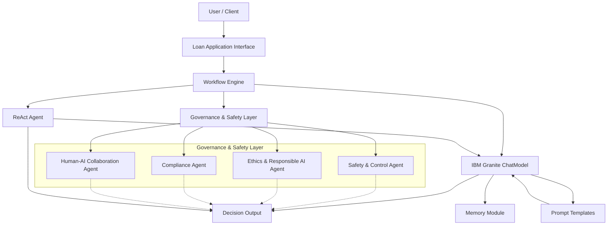

# Trustworthy AI Loan Approval System Tutorial

Welcome to the comprehensive tutorial for building a Trustworthy AI Loan Approval System using the BeeAI Framework and IBM Granite models. In this guide, you will learn how to integrate a robust Safety and Governance layer into an AI-driven solution that automates loan approvals while ensuring ethical, regulatory, and human oversight.

---

## Table of Contents

1. [Introduction](#introduction)
2. [Project Overview](#project-overview)
3. [Prerequisites](#prerequisites)
4. [Project Structure](#project-structure)
5. [Step 1: Setting Up the Environment](#step-1-setting-up-the-environment)
6. [Step 2: Building Governance Agents](#step-2-building-governance-agents)
    - [Safety & Control Agent](#safety--control-agent)
    - [Ethics & Responsible AI Agent](#ethics--responsible-ai-agent)
    - [Regulatory Compliance Agent](#regulatory-compliance-agent)
    - [Human-AI Collaboration Agent](#human-ai-collaboration-agent)
7. [Step 3: Creating Prompt Templates](#step-3-creating-prompt-templates)
8. [Step 4: Integrating IBM Granite ChatModel](#step-4-integrating-ibm-granite-chatmodel)
9. [Step 5: Implementing Workflows](#step-5-implementing-workflows)
10. [Step 6: Demonstrating ReAct Agents](#step-6-demonstrating-react-agents)
11. [Step 7: Running the End-to-End Application](#step-7-running-the-end-to-end-application)
12. [Conclusion](#conclusion)

---

## Introduction

Modern AI systems promise tremendous benefits, but they can also introduce risks such as bias, errors, security vulnerabilities, and ethical dilemmas. This tutorial demonstrates how to build an AI-driven loan approval system that integrates multiple layers of governance. Our solution leverages IBM Granite models to deliver efficient and scalable operations while enforcing safety, ethics, and compliance.

---

## Project Overview

Our solution consists of:
- **Governance Agents:** Dedicated modules for monitoring bias, ensuring ethical decision criteria, auditing regulatory compliance, and enabling human oversight.
- **Prompt Templates:** Dynamically generating and formatting prompts for the IBM Granite ChatModel.
- **Chat Model Integration:** Using IBM Granite (via the Ollama provider) to process queries and generate responses.
- **Workflows:** Automating the end-to-end process of loan approvals.
- **ReAct Agents:** Implementing intelligent reasoning and action capabilities.

---

## Prerequisites

Before you start, ensure you have:
- Python 3.8 or higher installed.
- Required Python packages (see `requirements.txt`).
- BeeAI Framework installed.
- IBM Granite configured (using the Ollama provider).
- (Optional) A running SearXNG instance if you want to integrate web search functionality.

Install dependencies with:
```bash
pip install -r requirements.txt
```

---

## Project Structure

Below is the recommended file structure for the project:

```
ai-governance-framework/
├── README.md
├── LICENSE
├── requirements.txt
├── hackathon_presentation.md
├── .gitignore
├── docs/
│   ├── tutorial.md       # (This file)
│   └── architecture_diagram.png
└── src/
    ├── __init__.py
    ├── main.py
    ├── agents.py
    ├── governance.py
    ├── prompt_templates.py
    ├── chat_model_examples.py
    ├── workflows.py
    └── react_agents.py
```

Each file is dedicated to specific components of the system. This modular structure makes the project scalable and easy to navigate.

## Architecture



This diagram shows how a user's loan application flows through the system, with the Workflow Engine coordinating interactions between the Governance & Safety Layer (which includes the key agents), the IBM Granite ChatModel (enhanced with prompt templates and memory), and the ReAct agent to produce a final decision output.

---

## Step 1: Setting Up the Environment

Start by cloning the repository and installing the dependencies:

```bash
git clone https://github.com/ruslanmv/ai-governance-framework.git
cd ai-governance-framework
pip install -r requirements.txt
```

---

## Step 2: Building Governance Agents

Our governance agents are the backbone of the safety and compliance layer. They ensure that our loan approval system is fair, transparent, and adheres to regulations.

### Safety & Control Agent

This agent monitors incoming loan application data for potential bias.

```python
# File: src/agents.py (excerpt)

class SafetyControlAgent:
    def monitor_loan_data(self, loan_applications):
        """Monitors loan applications for potential bias."""
        demographic_data = self._extract_demographic_data(loan_applications)
        bias_detected = self._analyze_for_bias(demographic_data)
        if bias_detected:
            self._trigger_alert(f"Potential bias detected: {bias_detected}")
        else:
            print("SafetyControlAgent: No bias detected in loan approvals.")

    def _extract_demographic_data(self, loan_applications):
        print("SafetyControlAgent: Extracting demographic data...")
        return {"demographics": [app["demographic"] for app in loan_applications]}

    def _analyze_for_bias(self, demographic_data):
        print("SafetyControlAgent: Analyzing for bias...")
        if demographic_data["demographics"].count("group_A") > 2:
            return "Disproportionate rejection rate for group A"
        return None

    def _trigger_alert(self, message):
        print(f"SafetyControlAgent ALERT: {message}")
```

### Ethics & Responsible AI Agent

Reviews decision criteria to ensure ethical compliance.

```python
# File: src/agents.py (excerpt)

class EthicsAgent:
    def review_decision_criteria(self, loan_criteria):
        """Reviews loan decision criteria for ethical alignment."""
        ethical_guidelines = self._load_ethical_guidelines()
        unethical_criteria = self._identify_unethical_criteria(loan_criteria, ethical_guidelines)
        if unethical_criteria:
            self._flag_criteria(unethical_criteria)
        else:
            print("EthicsAgent: Loan criteria align with ethical guidelines.")

    def _load_ethical_guidelines(self):
        print("EthicsAgent: Loading ethical guidelines...")
        return [
            "Do not discriminate based on protected characteristics",
            "Ensure transparency",
            "Promote fairness"
        ]

    def _identify_unethical_criteria(self, loan_criteria, ethical_guidelines):
        print("EthicsAgent: Identifying unethical criteria...")
        unethical = []
        for criterion in loan_criteria:
            if criterion in ["Zip Code Risk Score", "Name Ethnicity Score"]:
                unethical.append(criterion)
        return unethical

    def _flag_criteria(self, unethical_criteria):
        print(f"EthicsAgent ALERT: Unethical criteria identified: {unethical_criteria}")
```

### Regulatory Compliance Agent

Audits loan decisions for adherence to legal standards.

```python
# File: src/agents.py (excerpt)

class ComplianceAgent:
    def audit_for_compliance(self, loan_decisions):
        """Audits loan decisions for regulatory compliance."""
        regulations = self._load_regulations()
        non_compliant_decisions = self._check_compliance(loan_decisions, regulations)
        if non_compliant_decisions:
            self._generate_report(non_compliant_decisions)
        else:
            print("ComplianceAgent: Loan decisions are compliant with regulations.")

    def _load_regulations(self):
        print("ComplianceAgent: Loading financial regulations...")
        return {"Consumer Protection Law": "Rule X", "Anti-Discrimination Act": "Rule Y"}

    def _check_compliance(self, loan_decisions, regulations):
        print("ComplianceAgent: Checking compliance...")
        non_compliant = []
        for decision in loan_decisions:
            if decision.get("reason") == "discriminatory_criterion":
                non_compliant.append(decision)
        return non_compliant

    def _generate_report(self, non_compliant_decisions):
        print(f"ComplianceAgent ALERT: Compliance Report generated for non-compliant decisions: {non_compliant_decisions}")
```

### Human-AI Collaboration Agent

Enables human oversight for reviewing and overriding AI decisions.

```python
# File: src/agents.py (excerpt)

class HumanCollaborationAgent:
    def facilitate_human_review(self, loan_application, ai_decision):
        """Facilitates human review and potential override of AI decisions."""
        print("HumanCollaborationAgent: Loan application flagged for human review.")
        human_override = self._get_human_override_decision(loan_application, ai_decision)
        if human_override:
            final_decision = human_override
            print("HumanCollaborationAgent: Human override applied.")
        else:
            final_decision = ai_decision
            print("HumanCollaborationAgent: AI decision confirmed.")
        self._record_final_decision(loan_application, final_decision)

    def _get_human_override_decision(self, loan_application, ai_decision):
        print("HumanCollaborationAgent: Initiating human loan officer review process...")
        user_input = input(f"Review loan application for applicant {loan_application['applicant_id']} (AI decision: {ai_decision}). Override? (yes/no): ")
        if user_input.lower() == 'yes':
            return "approved"
        return None

    def _record_final_decision(self, loan_application, final_decision):
        print(f"HumanCollaborationAgent: Final loan decision for applicant {loan_application['applicant_id']} recorded as: {final_decision}")
```

---

## Step 3: Creating Prompt Templates

Prompt templates allow dynamic formatting of text for interacting with the ChatModel. We use BeeAI’s Mustache templating for this.

```python
# File: src/prompt_templates.py

from pydantic import BaseModel
from beeai_framework.utils.templates import PromptTemplate

# Define the input schema for a Retrieval-Augmented Generation (RAG) template
class RAGTemplateInput(BaseModel):
    question: str
    context: str

rag_template: PromptTemplate = PromptTemplate(
    schema=RAGTemplateInput,
    template="""
Context: {{context}}
Question: {{question}}

Provide a concise answer based on the context. Avoid phrases such as 'Based on the context'.""",
)

# Template for converting a question into a concise search query
class QuestionInput(BaseModel):
    question: str

search_query_template: PromptTemplate = PromptTemplate(
    schema=QuestionInput,
    template="""Convert the following question into a concise, effective web search query:
Question: {{question}}""",
)

# Template for generating an answer based on search results
class SearchRAGInput(BaseModel):
    question: str
    search_results: str

search_rag_template: PromptTemplate = PromptTemplate(
    schema=SearchRAGInput,
    template="""Search results:
{{search_results}}

Question: {{question}}
Provide a concise answer based on these results. If insufficient, say 'I don't know.'""",
)
```

---

## Step 4: Integrating IBM Granite ChatModel

We use IBM Granite (via the Ollama provider) to generate high-quality responses. The following example demonstrates a simple interaction.

```python
# File: src/chat_model_examples.py

import asyncio
from beeai_framework.backend.message import UserMessage, AssistantMessage
from beeai_framework.backend.chat import ChatModel, ChatModelInput, ChatModelOutput
from beeai_framework.memory.unconstrained_memory import UnconstrainedMemory

async def chat_model_demo():
    # Create a ChatModel instance using IBM Granite
    model = ChatModel.from_name("ollama:granite3.1-dense:8b")
    
    # Simple exchange with the model
    user_message = UserMessage(content="Hello! What is the capital of France?")
    output: ChatModelOutput = await model.create(ChatModelInput(messages=[user_message]))
    print("ChatModel Response:", output.get_text_content())
    
    # Demonstrate conversation memory
    memory = UnconstrainedMemory()
    await memory.add(user_message)
    await memory.add(AssistantMessage(content=output.get_text_content()))
    await memory.add(UserMessage(content="Can you recommend one thing to do in Paris?"))
    memory_output: ChatModelOutput = await model.create(ChatModelInput(messages=memory.messages))
    print("Memory-based Response:", memory_output.get_text_content())

if __name__ == "__main__":
    asyncio.run(chat_model_demo())
```

---

## Step 5: Implementing Workflows

Workflows automate the end-to-end process of loan approvals. They define a state and multiple steps to process and update that state.

### Loan Approval Workflow

```python
# File: src/workflows.py

import traceback
from pydantic import BaseModel, ValidationError
from beeai_framework.workflows.workflow import Workflow, WorkflowError
from agents import SafetyControlAgent, HumanCollaborationAgent

# Define the state for the loan approval process
class LoanApprovalState(BaseModel):
    applicant_id: int
    demographic: str
    loan_status: str = "pending"
    risk_flag: str | None = None
    final_decision: str | None = None

# Step 1: Monitor the loan application using the SafetyControlAgent
async def monitor_application(state: LoanApprovalState) -> str:
    safety_agent = SafetyControlAgent()
    safety_agent.monitor_loan_data([{
        "applicant_id": state.applicant_id,
        "demographic": state.demographic,
        "loan_status": state.loan_status
    }])
    if state.demographic == "group_A":
        state.risk_flag = "Potential bias detected for group A"
    return "review_decision"

# Step 2: Review and finalize the decision using the HumanCollaborationAgent
async def review_decision(state: LoanApprovalState) -> str:
    human_agent = HumanCollaborationAgent()
    human_agent.facilitate_human_review(
        {"applicant_id": state.applicant_id, "details": "Complex case"},
        state.loan_status
    )
    state.final_decision = "approved" if state.risk_flag is None else "requires further review"
    return Workflow.END

# Function to run the complete workflow
async def run_loan_approval_workflow():
    try:
        loan_workflow = Workflow(schema=LoanApprovalState, name="LoanApprovalWorkflow")
        loan_workflow.add_step("monitor_application", monitor_application)
        loan_workflow.add_step("review_decision", review_decision)
        # Simulate a loan application
        loan_state = LoanApprovalState(applicant_id=101, demographic="group_A")
        final_response = await loan_workflow.run(loan_state)
        return final_response.state
    except (WorkflowError, ValidationError) as e:
        traceback.print_exc()
        return None
```

---

## Step 6: Demonstrating ReAct Agents

ReAct agents separate reasoning from action, enabling dynamic and adaptive behavior. The example below shows how to create and run a ReAct agent.

```python
# File: src/react_agents.py

import asyncio
from typing import Any
from beeai_framework.agents.bee.agent import BeeAgent
from beeai_framework.agents.types import BeeInput, BeeRunInput, BeeRunOutput
from beeai_framework.backend.chat import ChatModel
from beeai_framework.memory.unconstrained_memory import UnconstrainedMemory
from beeai_framework.emitter.emitter import Emitter, EventMeta
from beeai_framework.emitter.types import EmitterOptions

async def run_react_agent():
    chat_model: ChatModel = ChatModel.from_name("ollama:granite3.1-dense:8b")
    memory = UnconstrainedMemory()
    agent = BeeAgent(bee_input=BeeInput(llm=chat_model, tools=[], memory=memory))

    async def process_agent_events(event_data: dict[str, Any], event_meta: EventMeta) -> None:
        if event_meta.name == "error":
            print("Agent 🤖:", event_data["error"])
        elif event_meta.name == "retry":
            print("Agent 🤖: retrying the action...")
        elif event_meta.name == "update":
            print("Agent update:", event_data["update"]["parsedValue"])

    async def observer(emitter: Emitter) -> None:
        emitter.on("*.*", process_agent_events, EmitterOptions(match_nested=True))

    result: BeeRunOutput = await agent.run(
        run_input=BeeRunInput(prompt="What chemical elements make up a water molecule?")
    ).observe(observer)
    print("ReAct Agent Response:", result.state)

if __name__ == "__main__":
    asyncio.run(run_react_agent())
```

---

## Step 7: Running the End-to-End Application

The main entry point ties everything together by running both the ChatModel demo and the complete loan approval workflow.

```python
# File: src/main.py

import asyncio
import traceback
from agents import SafetyControlAgent, EthicsAgent, ComplianceAgent, HumanCollaborationAgent
from workflows import run_loan_approval_workflow
from chat_model_examples import chat_model_demo

async def main():
    print("=== Running Chat Model Demo ===")
    await chat_model_demo()
    
    print("\n=== Running Loan Approval Workflow ===")
    try:
        final_state = await run_loan_approval_workflow()
        print("Final Loan Application State:", final_state)
    except Exception as e:
        print("Error running workflow:", e)
        traceback.print_exc()

if __name__ == '__main__':
    asyncio.run(main())
```

---

## Conclusion

In this tutorial, you learned how to build a comprehensive Trustworthy AI Loan Approval System. We covered:

- **Governance Agents:** For safety, ethics, compliance, and human oversight.
- **Prompt Templates:** For dynamic text generation.
- **IBM Granite ChatModel Integration:** To process queries and maintain conversation history.
- **Workflows:** Automating multi-step processes.
- **ReAct Agents:** For adaptive decision making.

This solution not only streamlines business processes but also ensures that every decision is ethically and legally sound—a key competitive advantage in today’s market. Use this project as your foundation to innovate further and impress at the hackathon!

